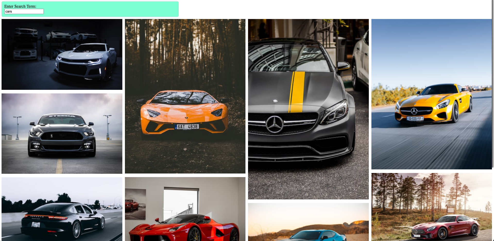

# PICS

## Description:
A React app using an API call to `upsplash.com` to render pictures using the search bar. This is another small project to practice using React.

Here is an overview of what skills I applied: 
- `Events` 
- `useState`
- `Event Handlers`
- `HTTP Requests`
- `Async:Await`
- `Handling Form Submission`
- `Building and displaying an image list`

[Click here](https://blksmk8483.github.io/pics/) to try it out yourself.

